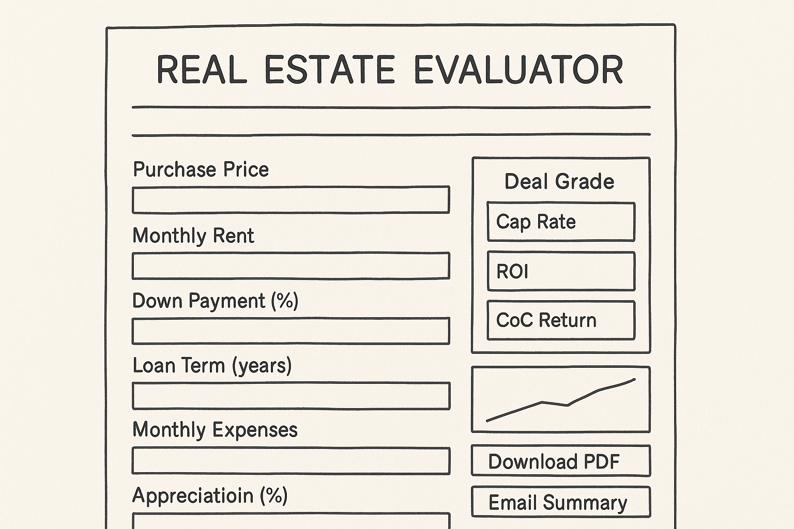

# 🏠 Real Estate Deal Evaluator

A simple, AI-assisted tool that helps first-time and small-scale real estate investors quickly evaluate property deals using key financial metrics.

## 🔧 Features

- Calculate Cap Rate, Cash-on-Cash Return, ROI
- Get AI-generated verdicts (e.g., “B-grade deal for cash buyer”)
- Export results as PDF
- No login required — clean, mobile-friendly UI
- Built using Streamlit

## 📦 Tech Stack

- Python 3.11
- Streamlit
- (Optional) OpenRouter or OpenAI for AI verdicts
- PyPDF2 / ReportLab for export (coming soon)

## 📁 Project Structure

```
real_estate_eval/
├── real_estate_eval.py       # Main app UI
├── calculations.py           # Financial metric functions
├── requirements.txt
├── .env.template             # Placeholder for future email or LLM API keys
└── README.md
```

## 🖼️ Wireframe Layout

Here is the layout of the MVP app:



## 🚀 Getting Started

1. Clone the repo  
2. Run `pip install -r requirements.txt`  
3. Start the app: `streamlit run real_estate_eval.py`

---

© 2025 Masoud Arouni | For demo use only
